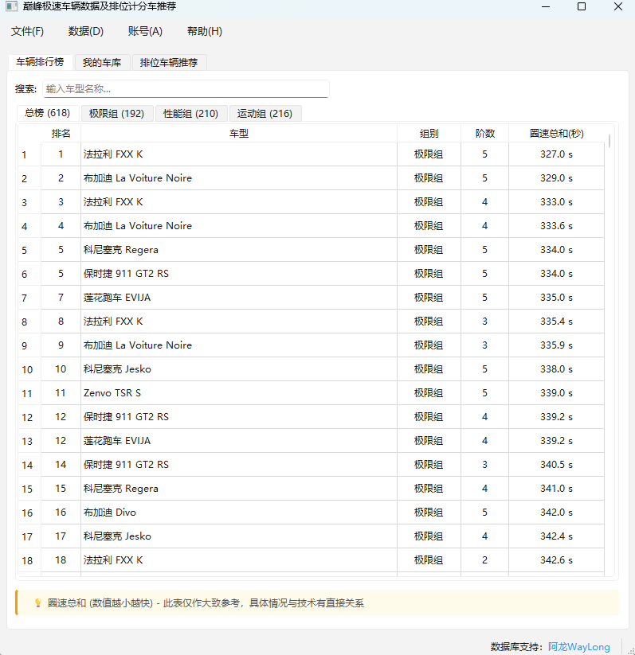
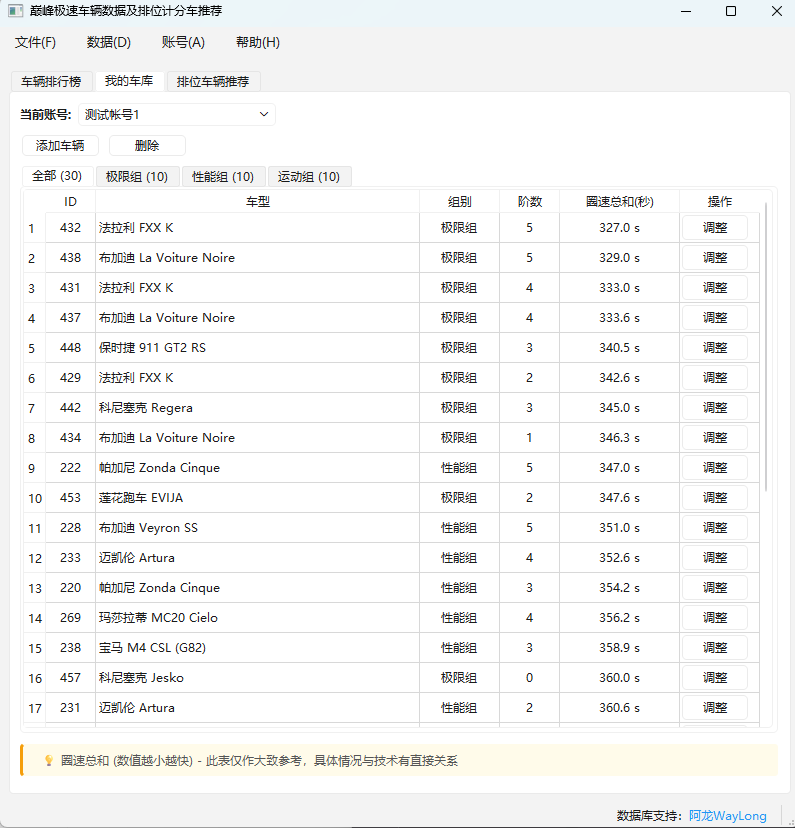
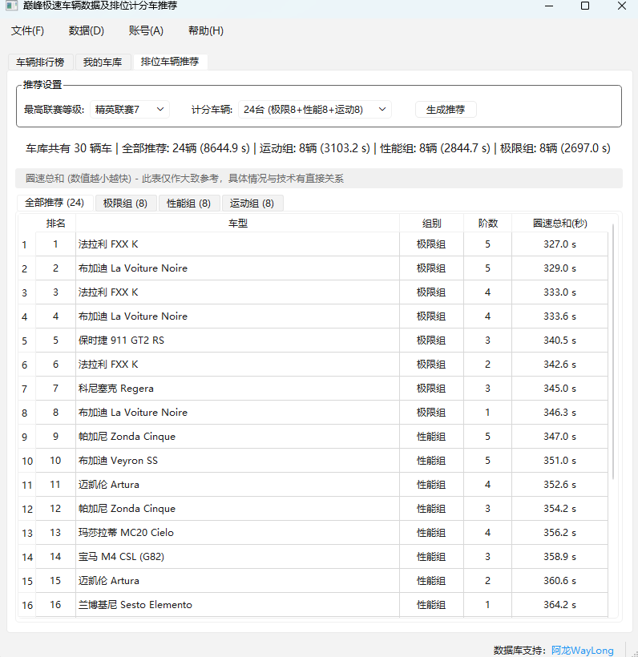

# RacingMaster-RankHelper

<div align="center">

[简体中文](README.md) | [English](README_EN.md)

A data-driven decision support tool designed for Peak Speed game players to optimize ranked race vehicle selection strategies.

[](https://opensource.org/licenses/MIT)
[](https://www.python.org/downloads/)
[](https://www.riverbankcomputing.com/software/pyqt/)

</div>

## ✨ Features

### 🏆 Vehicle Rankings
- Real-time lap time data for all vehicles
- Filter by category (Extreme/Performance/Sports)
- Sort by lap time, tier, or category
- Clean table display

### 🚗 My Garage
- Multi-account management
- Add/remove vehicles with custom tiers
- Inline adjustment buttons for quick tier upgrades
- Auto-sort by lap time

### 🎯 Ranked Vehicle Recommendations
- **Smart League System**: Support for 14 league levels (Rookie League 1 → Peak League)
- **Precise Scoring Vehicle Configuration**: Different scoring vehicle counts for each league level
- **Category-based Recommendations**: Independent recommendations for Extreme, Performance, and Sports
- **All Recommendations**: Combined recommendations sorted by total lap time
- **Flexible Adjustment**: Manual adjustment of scoring vehicle counts (for season week restrictions)

### 💾 Data Management
- Auto-update vehicle database from website
- Import/export vehicle and garage data (JSON format)
- SQLite local storage, fast and reliable

## 📸 Screenshots

### Vehicle Rankings
Real-time lap time data with category filtering and sorting.



### My Garage
Manage your vehicle collection with multi-account support and quick tier adjustments.



### Ranked Vehicle Recommendations
Smart recommendations based on league level to help you climb the leaderboard.



## 🚀 Quick Start

### Prerequisites

- Python 3.10 or higher
- pip package manager

### Installation

1. **Clone the repository**
```bash
git clone https://github.com/your-username/RacingMaster-RankHelper.git
cd RacingMaster-RankHelper
```

2. **Install dependencies**
```bash
pip install -r requirements.txt
```

Or using Poetry:
```bash
poetry install
```

3. **Install Playwright browsers** (for data updates)
```bash
playwright install chromium
```

### Launch Application

**GUI (Recommended):**
```bash
python run_gui.py
```

**CLI:**
```bash
python run.py
```

## 📖 Usage Guide

### 1. Update Vehicle Database
On first use, select `Data → Update Database` from the menu bar to fetch the latest vehicle lap time data.

### 2. Manage Garage
- In the "My Garage" tab, click the "Add Vehicle" button
- Select vehicle and tier from dropdown lists
- Use inline "Adjust" buttons for quick tier upgrades
- Support multi-account management with easy switching

### 3. Generate Recommendations
- Switch to "Ranked Vehicle Recommendations" tab
- Select your highest league level
- System automatically matches corresponding scoring vehicle count
- Click "Generate Recommendations" to view optimal combinations
- Manually adjust scoring vehicle count for special situations

### 4. League Level Reference

| League Level | Extreme | Performance | Sports | Total |
|-------------|---------|-------------|--------|-------|
| Rookie League 1 | 2 | 2 | 2 | 6 |
| Rookie League 2 | 3 | 3 | 3 | 9 |
| Rookie League 3 | 4 | 4 | 4 | 12 |
| Rookie League 4 | 5 | 5 | 5 | 15 |
| Elite League 1 | 6 | 6 | 6 | 18 |
| Elite League 2 | 7 | 6 | 6 | 19 |
| Elite League 3 | 7 | 7 | 6 | 20 |
| Elite League 4 | 7 | 7 | 7 | 21 |
| Elite League 5 | 8 | 7 | 7 | 22 |
| Elite League 6 | 8 | 8 | 7 | 23 |
| Elite League 7 | 8 | 8 | 8 | 24 |
| Elite League 8 | 9 | 8 | 8 | 25 |
| Elite League 9 | 9 | 9 | 8 | 26 |
| Peak League | 9 | 9 | 9 | 27 |

## 🛠️ Tech Stack

- **Language**: Python 3.10+
- **GUI Framework**: PyQt6
- **Database**: SQLite + SQLAlchemy ORM
- **Web Scraper**: Playwright
- **Testing**: pytest + Hypothesis
- **Dependency Management**: Poetry

## 🤝 Contributing

Contributions, issues, and feature requests are welcome!

See [CONTRIBUTING.md](CONTRIBUTING.md) for details.

## 📝 Changelog

See [CHANGELOG.md](CHANGELOG.md) for version history.

## 📄 License

This project is licensed under the MIT License - see the [LICENSE](LICENSE) file for details.

## 🙏 Acknowledgments

- Vehicle data source: [WayLong](https://waylongrank.top/index.html)
- Thanks to all contributors

## ⚠️ Disclaimer

This tool is for educational and research purposes only. Users are responsible for any consequences of using this tool.

---

<div align="center">

If this project helps you, please give it a ⭐️ Star!

Made with ❤️ by the community

</div>
